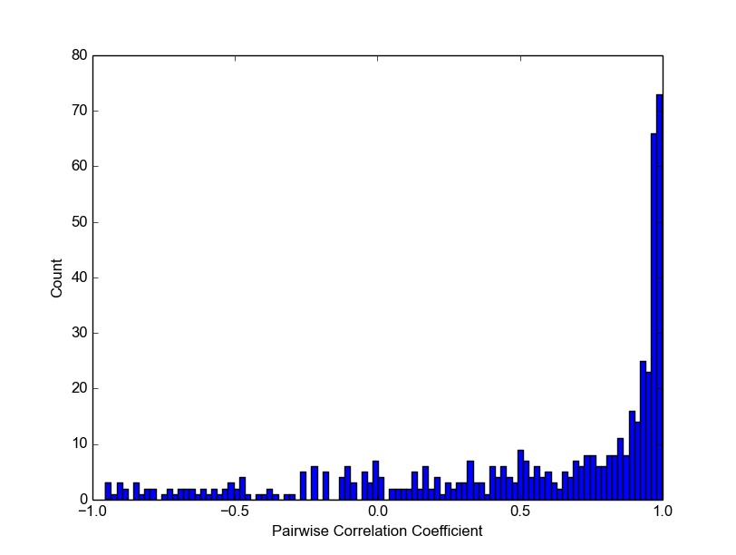
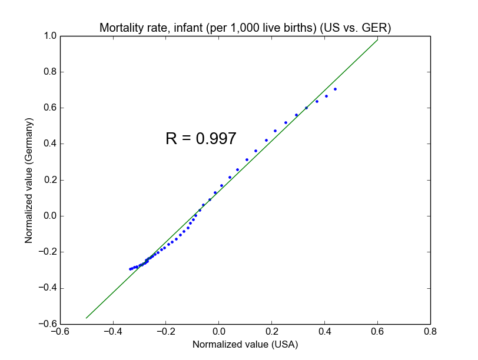
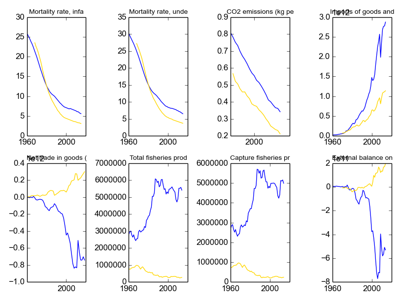
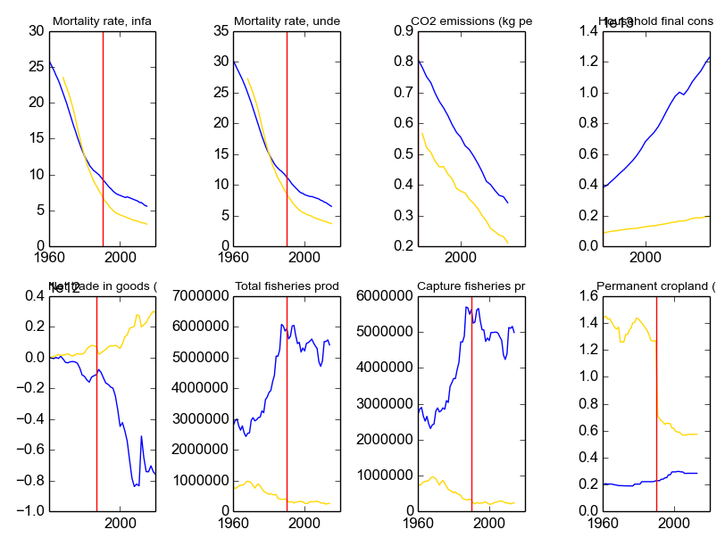
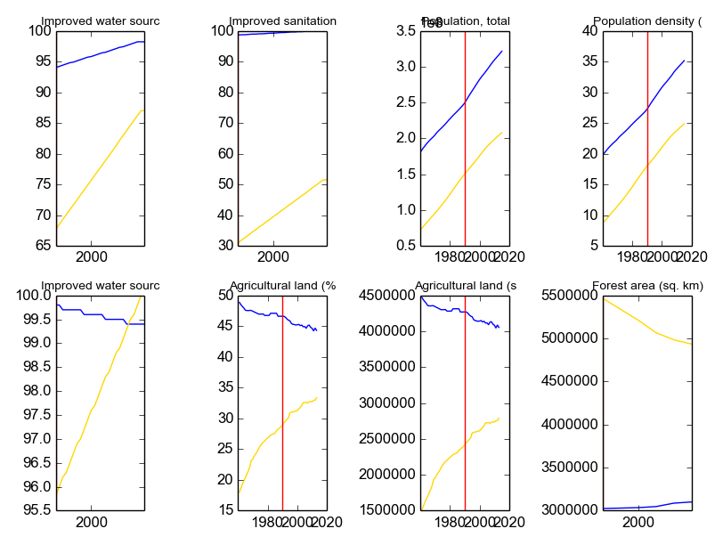
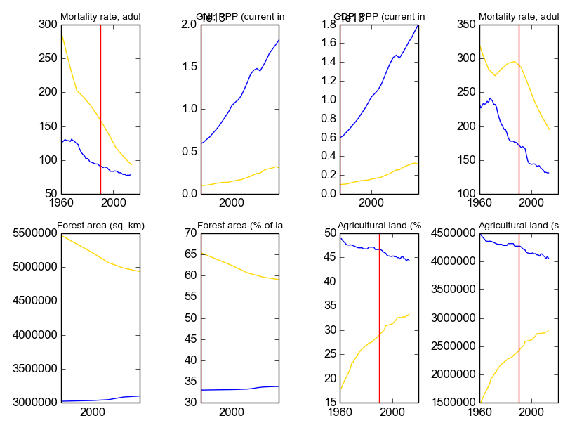

# The World Bank World Development Indicators - Correlations across the globe

I chose to compare the development indicators of the World Bank for the US and Germany, which are the country I currently live in and my home country, respectively. I was interested to see both how correlated different indicators are (over time) and if there were years with more or less correlation between the indicators in the two countries.

The data is available at http://data.worldbank.org/country

The [World Bank](https://en.wikipedia.org/wiki/World_Bank) is an international financial institution with many functions, such as providing loans to developing countries, with the official goal to reduce poverty in the world.

The World Development Indicators (WDIs) are a set of over 1000 metrics published by the World Bank for every country or region, going back to 1960. The WDIs are used to assess the development of a country or region. Examples of WDIs are:

* Arable land (hectares)
* Net trades (US dollars)
* Infant mortality rate
* Electricity from renewables (kWh)
* CO2 emissions (kt)
* etc.

The data can be downloaded directly from the [website](http://data.worldbank.org/country) as an excel or csv file for each country. This project works exclusively with the csv format (comma separated values). csv files for three countries (USA, Germany, Brazil) can be found in this repository. 

An example screenshot of the tabular data when viewed in your favorite spreadsheet viewer can be seen here:

Each of the 1000+ WDIs is listed from 1960 to 2015. As you can see the data is not perfectly clean. One of the major issues is missing data points. Many indicators are missing for certain (or all) years for a certain region. Additionally a variety of different units are used for the different metrics and each WDI can be on very different scales depending on the region or year, with smaller or bigger range of values depending on the region.

Data cleanup steps include:
* Identification of data rows/columns, removal or empty ones
* Removal of missing data points without “shifting” data (data point for 1970 needs to stay assigned to 1970 even if years before are removed)
* --> Solution: keep missing data points around as 0.0 and remove only when necessary
* When appropriate, data was scaled by subtracting average for that metric (over all years) and dividing by range (max-min) for that metric

All analysis was done with the following tools:
* Python
* Emacs
* Numpy (python library)
* Matplotlib (python library)
* Scipy (python library)
* csv (python library)

After scaling the different indicators for each country appropriately, we can now look at correlation plots for two countries in different years.

Here is what correlation plots look like for Germany and the United States, plotted for every five years.

 Each dot in each subplot represents on indicator's value normalized by subtracting the mean value of that indicator over all years and dividing by the range of the values for the indicator (for each country respectively). The US values are on the x axes and the German values are on the y axes.

As we can see correlations between the WDIs vary strongly for different years. To visualize the correlation for each year we can use linear regression (using scipy.stats):

For the USA vs. Brazil this would look like this:

And for Germany vs. Brazil it would look like this:

Now let's see how the correlation coefficients (the slope of the lines in these graphs) develop over time.

This is what it looks like for Germany and the US:

What's interesting is that the correlation between the countries seems to decrease until the mid nineties with a strange spike in 1990 and then creeps up again in more recent years. If we look at the historical context, it seems plausible that the end of the cold war and German Reunification play a role here. Let's try to add this to the plot:

Similarly, we can plot the correlation coefficients over time for the USA against Brazil and Germany against Brazil:

It's a bit hard to compare them all like this so let's put all of them into the same figure:

A few interesting things can be seen in this last figure. The correlation between the US was fairly high in the 60s with both Brazil and Germany but declined until the 90s. Since then it steadily increased, together with growing globalization, to a new high in recent years. Brazil and Germany show fairly low correlation before the year 2000 and only in recent years have started to correlate to a similar degree as each country with the USA, probably also due to a more globalized economy.

---

Lastly, I wanted to look at not correlations across indicators over time but correlations over time of each indicator. To this end, I calculated correlation coefficients over time for each pair of identical indicators for two countries. For example the correlation coefficient for infant mortality rate from 1960 to 2015 for the USA and Germany. I did this for all 1000+ indicator pairs.

Here is a histogram of all pairs for the United States and Germany:

As you can see, the majority of indicators have fairly good positive correlations (between 0.5 and 1.0) but there are a good number of non correlated or anti correlated metrics. One of the highest correlations between the two countries is the indicator "infant mortality rate per 1000 births", with a correlation coefficient of 0.997:

Other highly correlated WDIs are:

* Infant mortality rate (per 1000 live births)
* Mortality rate of under 5 year olds (per 1000 live births)
* CO2 emissions (kg per US$ of GDP)
* Imports of Goods and Services (US$)
* and many more

Examples of anticorrelated metrics include:

* Net trade in goods and services (US$)
* Total fisheries production (metric tons)
* Capture fisheries production (metric tons)
* External balance on goods and services (US$)
* a few more
 
Let's look at some unnormalized plots for the top correlated and anticorrelated metrics, in their respective units:

For the anticorrelated metrics in particular, the end of the cold war seems to be a meaningful event:

For other country pairs the top correlated and anticorrelated pairs are different of course.

This is what the top and bottom four WDIs look like for the US and Brazil:

A more obvious takeaway from this last figure is that the end of the cold war had barely any influence on the correlations between Brazil and the US, which makes sense because the US's relationship with Brazil was much less affected by this than its relationship with Germany.

Similarly, the plots for Germany and Brazil show little change around 1990, with correlations being less pronounced in general between these two countries:

---

To be continued...

